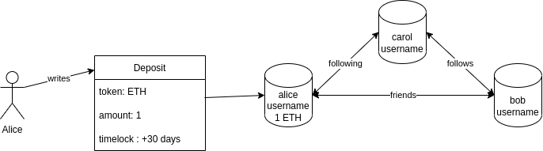
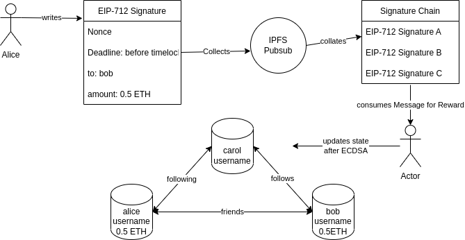
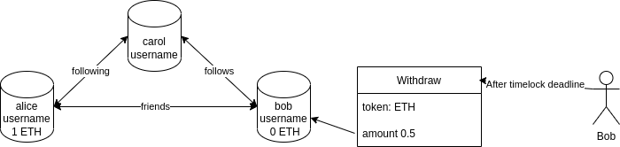

# Introduction
### Why a Social graph with timelocking deposit boxes that chains EIP-712 signatures together with IPFS Pubsub?
:::info
Saves gas, like riding a bus. 
:::
Reputation can mean efficiency.  Tardigrade enables a class of low security, high efficiency defi as the situation nessissates as sufficient.  Think things like an honourboxes, tip jars, bar tabs, and hopefully one day, undercollateralized IOUs.  A user can stake to their username and offer claims against it with ECDSA signatures.  These signatures are chained in a mother EIP-712 signature that can be consumed by a 3rd party for a network incentive.  Than users can move many more micropayments for less state transition and call gas.  Usernames event log indicies forshadow a reputation crafted over time that can be used in higher efficiency games

### Social Graph System

### Signature Chaining System

### Defi Metagames

### Example: Signature Chains on Timelocks
A user begins by depositing a crypto of choice, say ETH beneath their username. Additionally, this deposit box is timelocked to a certain date, say 30 days from today.  During this period withdrawal is not possible, but one can write [EIP-712](https://eips.ethereum.org/EIPS/eip-712) signatures so that another user can come along later (before the deadline) claim the signature, and update the state. 

 If it is many payments to the same entity within the deadline, the values are pooled in memory instead of turning the state for each on individually.  A mother EIP-712 signature chains them to max block gas. A user can harvest it, updating all the state within all the signatures, in exchange for a cryptographic reward.  Even a bot could do it, running off LP rewards.  Such signature chaining can be performed in a decentralized manner with tools like IPFS pubsub.

After the deadline timelock has passed, users can now sweep any funds that are under their usernames or relock them in a new timelock.

